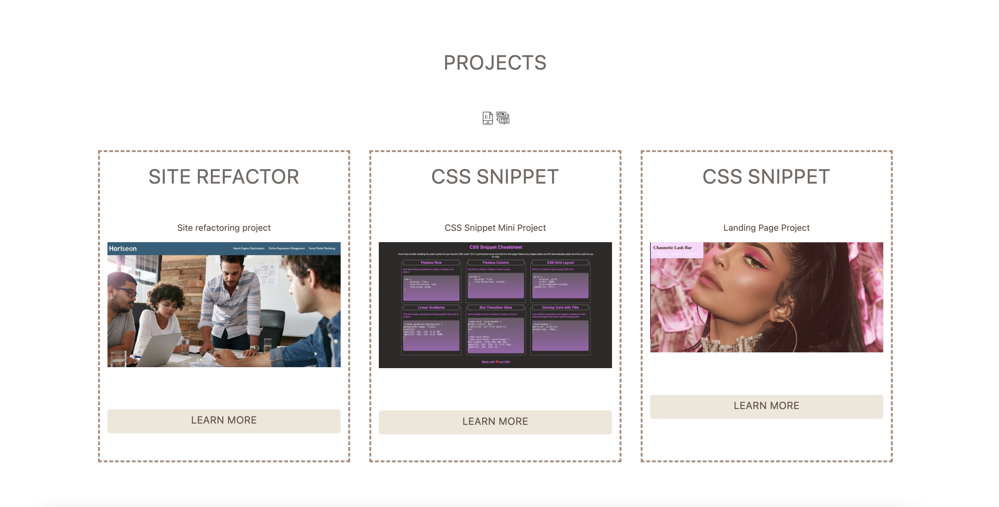

# css-portfolio

This is a short CSS portfolio that tells you more about me! 💁🏻‍♀️

## Acceptance Criteria

- Developer's name, a recent photo, and links to sections about them, their work, and how to contact them
- UI scrolls to the corresponding section when clicks on one of the links in the navigation
- UI scrolls to a section with titled images of the developer's applications
- Application's image should be larger in size than the others when hovered over. 
- Taken to the deplpoyed application after clicking on images of the applications
- Responsive layout that fits other screen sizes. 

## What you will find on my website:

Step 1: Created a CSS portfolio landing webpage with what was covered for the past two weeks:
Flexbox, Media Queries and CSS variables.

Step 2: Created a navigation bar at the top right hand corner with four tabs by using `<nav>` and `<li>` tags and align the texts with `display: flex` so that they are side-by-side.

Step 3: Created `<section>` to place each application inside a framed column. Created `<box>`id to style the words so they are alined in multiple lines.

Step 4: Downloaded social media logo .png files as links to my different social media platforms: LinkedIn, Facebook, Twitter.

Step 5: Attached my resume at the `About Me` section.

Step 6: UI scrolls to the corresponding section when clicks on one of the links in the navigation bar using `scroll-behavior: smooth;` CSS property.

Step 7: Media Queries that creates a responsive layout that fits other screen sizes. 
When the screen is smaller than 991px or 768px, the boxes will stack on each other in columns. The size of the boxes will also become smaller. 

Step 8: Used flaticons to add more creative contents to my portfolio. 

## Screenshot of the website

## Technical Checklist: 

Application's links all function correctly.

Application's CSS selectors and properties are consolidated and organized to follow semantic structure.

Application deployed at live URL.

Application loads with no errors.

Application GitHub URL submitted.

GitHub repository contains application code.

## Repository Quality: 

Repository has a unique name (css-portfolio)

Repository follows best practices for file structure and naming conventions.

Repository contains multiple descriptive commit messages.

Repository contains quality readme with description, screenshot, link to deployed application.

## Built With

* [HTML](https://developer.mozilla.org/en-US/docs/Web/HTML)
* [CSS](https://developer.mozilla.org/en-US/docs/Web/CSS)
* [Javascript](https://developer.mozilla.org/en-US/docs/Web/JavaScript)
* [Flaticon] (https://www.flaticon.com)

## Deployed Link

* https://chaunnybby7.github.io/css-portfolio/

## Authors

* **YiLin Ong** 

- [Link to Portfolio Site](https://github.com/chaunnybby7/css-portfolio)
- [Link to Github](https://github.com/chaunnybby7)
- [Link to LinkedIn](https://www.linkedin.com/in/chauntelleong)

